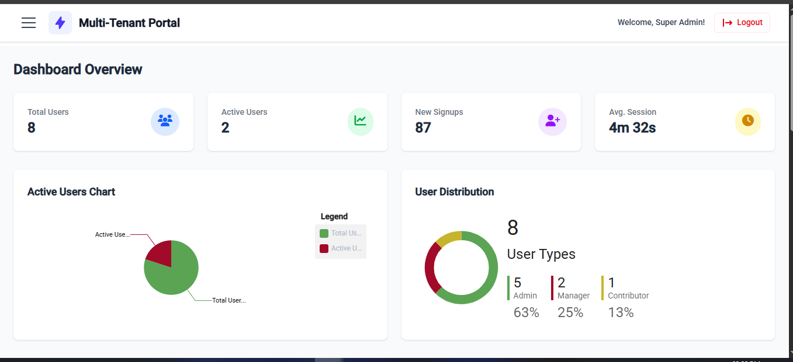

# TenantAdminPortal

A scalable Angular-based admin dashboard with multi-tenant support, RBAC, and real-time analytics.  
*(Inspired by Atlassian Admin/Firebase Console)*  

[](https://angular.io/)
[](LICENSE)

## ✨ Features

### 🏢 Organization Management  
- Tenant isolation via `tenantId` injection  
- Superadmin controls with soft-delete functionality  
- Dynamic branding (logos/themes per tenant)  

### 👥 Team & User Management  
- Role-Based Access Control (RBAC) hierarchy  
- User impersonation for admins  
- Simulated email invitations  

### 🛠️ Dynamic Feature Toggles  
- JSON-configurable UI components  
- Tenant-level feature flags (Billing/Chat modules)  

### 📈 Real-Time Analytics  
- Live user activity dashboards  
- WebSocket-driven metrics  

## 🏗️ Architecture
```mermaid
🧩 Modular Design
The app is split into feature-based modules for scalability and maintainability:
- `/auth` – Authentication & session management
- `/providers` – Manage custom providers in project
- `/shared` – Reusable components, services, guards, directives
- `/tenant` – User & settings management
- `/superadmin` – Tenant management
- `/features` – Dynamic feature toggles
- `/dashboard` – Real-time analytics

🌐 Multi-Tenancy Strategy
- **Tenant Identification**: Extracted via JWT token or request context
- **Data Isolation**: All backend records include `tenantId`
- **Dynamic Branding**: App layout and themes adapt per tenant settings
- **Tenant Schemas (optional)**: Supports schema-per-tenant DB design

```

## Project Structure 

```text
    src/
    └──app/
        ├── auth/ 
        |     └── guards/         
        ├── providers/
        ├── shared/ 
        ├── superadmin/ 
        └── tenant/         

```
## Installation
```bash
 # Clone repo
git clone https://github.com/imPrinceSingh/tenant-management.git
cd tenant-management

# Install dependencies
npm install

# Start mock API (requires Docker)
json-server --watch db.json

# Run application
npm start
```
## Demonstrations 

### Tenant Organization View


### i18n & Theming


### Role-Based User Management


### Brand Settings


---

## 🔐 Login Credentials

### SuperAdmin

- **Login Route**: `/admin-login`  
- **Email**: `super@admin.com`  
- **Password**: `supersecure`  

### Tenant Users

- **Login Route**: `/`  
- **Email**: `alice@acme.com`  
- **Password**: `user123`  
- *More users available in `db.json` or create via `/user-management`*

---

## 📄 License

This project is licensed under the MIT License.- Prince Singh